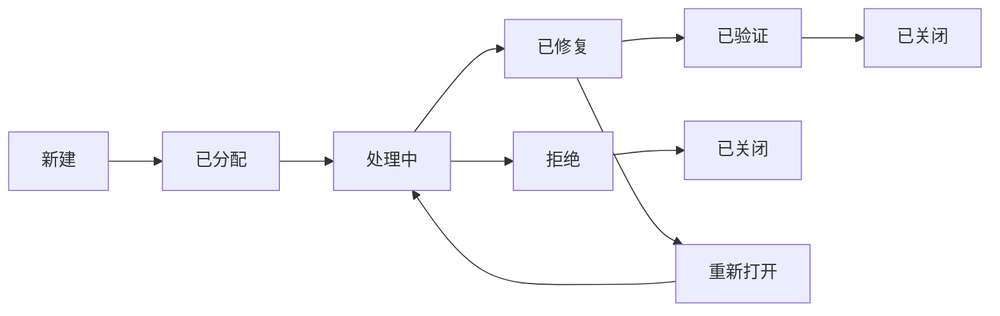

# 测试管理工具

测试管理工具是测试团队进行测试计划、用例管理、缺陷跟踪和测试报告的核心平台。本文将介绍主流的测试管理工具及其使用实践。

## 🎯 测试管理工具的作用

### 核心功能
1. **测试计划管理**：制定和管理测试计划
2. **测试用例管理**：创建、维护和执行测试用例
3. **缺陷跟踪管理**：记录、跟踪和验证缺陷
4. **测试执行管理**：安排和执行测试任务
5. **测试报告生成**：生成测试进度和质量报告
6. **需求跟踪**：关联需求和测试用例
7. **团队协作**：支持多人协作和权限管理

### 价值体现
- **提高测试效率**：标准化测试流程
- **保证测试质量**：完整的测试覆盖
- **促进团队协作**：信息透明和共享
- **支持决策分析**：数据驱动的质量决策
- **知识积累**：测试资产沉淀和复用

## 📊 主流测试管理工具

### 1. JIRA + Test Management
```properties
# 特点
- 与JIRA深度集成
- 支持敏捷测试
- 强大的自定义能力
- 丰富的插件生态

# 适用场景
- 敏捷开发团队
- 需要与开发流程深度集成的团队
- 大中型企业

# 核心功能
- 测试计划管理
- 测试用例管理
- 测试执行跟踪
- 缺陷管理
- 测试报告
```

### 2. 禅道（Zentao）
```properties
# 特点
- 国产开源软件
- 一体化项目管理
- 符合国内使用习惯
- 社区活跃

# 适用场景
- 国内中小型企业
- 需要一体化解决方案的团队
- 预算有限的团队

# 核心功能
- 产品管理
- 项目管理
- 测试管理
- 缺陷管理
- 文档管理
```

### 3. TestRail
```properties
# 特点
- 专业的测试管理工具
- 界面简洁易用
- 强大的报告功能
- 支持多种集成

# 适用场景
- 专业的测试团队
- 需要详细测试报告的场景
- 与CI/CD集成的场景

# 核心功能
- 测试用例管理
- 测试计划管理
- 测试执行跟踪
- 自定义报告
- API集成
```

### 4. qTest
```properties
# 特点
- 企业级测试管理
- 支持敏捷和瀑布
- 强大的分析功能
- Tricentis产品线

# 适用场景
- 大型企业
- 需要企业级解决方案
- 复杂测试流程管理

# 核心功能
- 需求管理
- 测试用例管理
- 测试执行管理
- 缺陷管理
- 测试分析
```

### 5. Zephyr
```properties
# 特点
- JIRA原生插件
- 轻量级测试管理
- 实时报告
- 移动端支持

# 适用场景
- 使用JIRA的团队
- 需要轻量级测试管理的团队
- 敏捷开发团队

# 核心功能
- 测试用例管理
- 测试执行跟踪
- 实时仪表板
- 移动端测试
```

## 📝 测试用例管理

### 测试用例设计原则
```markdown
## 1. 可读性原则
- 用例标题清晰明确
- 步骤描述简洁易懂
- 预期结果具体可验证

## 2. 可维护性原则
- 模块化设计
- 参数化配置
- 版本控制

## 3. 可执行性原则
- 步骤可操作
- 数据可准备
- 结果可验证

## 4. 可复用性原则
- 通用用例模板
- 数据驱动设计
- 组件化用例
```

### 测试用例结构
```yaml
# 测试用例模板
用例ID: TC-001
用例标题: 用户登录功能测试
优先级: P1（高）
模块: 用户管理/登录
前置条件:
  - 用户已注册
  - 系统正常运行
测试步骤:
  - 步骤1: 打开登录页面
  - 步骤2: 输入有效用户名
  - 步骤3: 输入有效密码
  - 步骤4: 点击登录按钮
预期结果:
  - 登录成功
  - 跳转到首页
  - 显示用户欢迎信息
测试数据:
  - 用户名: testuser
  - 密码: Test@123
关联需求: REQ-001
创建人: 张三
创建时间: 2024-01-01
```

### 测试用例分类
```properties
# 按测试类型分类
- 功能测试用例
- 性能测试用例
- 安全测试用例
- 兼容性测试用例
- 用户体验测试用例

# 按优先级分类
- P0: 核心功能，必须测试
- P1: 重要功能，优先测试
- P2: 一般功能，正常测试
- P3: 边缘功能，可选测试

# 按执行频率分类
- 冒烟测试用例
- 回归测试用例
- 全量测试用例
- 专项测试用例
```

## 🔧 缺陷管理流程

### 缺陷生命周期


### 缺陷报告模板
```yaml
# 缺陷报告模板
缺陷ID: BUG-001
缺陷标题: 登录页面密码输入框无长度限制
严重程度: 严重
优先级: 高
缺陷状态: 新建
缺陷类型: 功能缺陷
重现步骤:
  - 步骤1: 打开登录页面
  - 步骤2: 在密码输入框中输入超过1000个字符
  - 步骤3: 点击登录按钮
实际结果: 系统无响应，页面卡死
预期结果: 密码长度应有合理限制
环境信息:
  - 浏览器: Chrome 120.0
  - 操作系统: Windows 11
  - 网络: 公司内网
附件: 
  - 截图: login_error.png
  - 日志: error.log
报告人: 李四
报告时间: 2024-01-01 10:00:00
```

### 缺陷严重程度定义
```properties
# 严重程度定义
1. 致命（Critical）
   - 系统崩溃
   - 数据丢失
   - 安全漏洞
   - 核心功能完全失效

2. 严重（Major）
   - 主要功能失效
   - 性能严重下降
   - 重要数据错误
   - 影响主要业务流程

3. 一般（Normal）
   - 次要功能失效
   - 界面显示问题
   - 提示信息错误
   - 不影响主要功能

4. 轻微（Minor）
   - 界面细节问题
   - 文字错误
   - 用户体验问题
   - 建议性改进
```

### 缺陷优先级定义
```properties
# 优先级定义
1. 立即解决（P0）
   - 阻塞测试或开发
   - 影响上线计划
   - 严重安全问题

2. 高优先级（P1）
   - 影响核心功能
   - 影响用户体验
   - 需要在当前版本修复

3. 中优先级（P2）
   - 影响次要功能
   - 可以在下个版本修复
   - 不影响当前版本发布

4. 低优先级（P3）
   - 界面优化
   - 体验改进
   - 可以在后续版本修复
```

## 📊 测试执行管理

### 测试计划制定
```yaml
# 测试计划模板
计划名称: V2.0版本回归测试计划
测试范围:
  - 模块1: 用户管理
  - 模块2: 订单管理
  - 模块3: 支付功能
测试类型:
  - 功能回归测试
  - 兼容性测试
  - 性能测试
测试资源:
  - 测试人员: 3人
  - 测试环境: 测试环境1
  - 测试工具: JIRA, Selenium, JMeter
时间安排:
  - 开始时间: 2024-01-01
  - 结束时间: 2024-01-07
  - 每日进度: 20%
风险评估:
  - 风险1: 测试环境不稳定
  - 风险2: 测试数据准备不足
  - 应对措施: 提前验证环境，准备备份数据
验收标准:
  - 所有P0用例通过率100%
  - 所有P1用例通过率95%
  - 严重缺陷修复率100%
```

### 测试任务分配
```properties
# 任务分配原则
1. 专业匹配: 根据测试人员专长分配任务
2. 负载均衡: 合理分配工作量
3. 经验传承: 新老搭配，知识传递
4. 备份机制: 关键任务有备份人员

# 任务跟踪
- 每日站会同步进度
- 使用看板管理任务状态
- 定期检查任务完成情况
- 及时调整任务分配
```

### 测试进度跟踪
```properties
# 进度跟踪指标
1. 测试用例执行进度
   - 计划执行数
   - 已执行数
   - 执行完成率

2. 缺陷跟踪进度
   - 新增缺陷数
   - 已修复缺陷数
   - 待验证缺陷数
   - 缺陷修复率

3. 测试覆盖率
   - 需求覆盖率
   - 代码覆盖率
   - 功能覆盖率

4. 测试质量指标
   - 测试通过率
   - 缺陷密度
   - 缺陷逃逸率
```

## 📈 测试报告与分析

### 测试报告类型
```properties
# 日报
- 当日测试进度
- 发现的主要问题
- 明日测试计划
- 需要协调的事项

# 周报
- 本周测试总结
- 关键指标分析
- 风险预警
- 下周计划

# 版本报告
- 版本测试总结
- 质量评估
- 发布建议
- 经验教训

# 专项报告
- 性能测试报告
- 安全测试报告
- 兼容性测试报告
- 用户体验报告
```

### 测试报告模板
```markdown
# 测试报告

## 1. 测试概述
### 1.1 测试目标
- 验证V2.0版本功能完整性
- 评估系统性能表现
- 确认发布质量

### 1.2 测试范围
- 功能测试: 用户管理、订单管理、支付功能
- 性能测试: 登录、下单核心场景
- 兼容性测试: Chrome, Firefox, Edge

### 1.3 测试环境
- 测试服务器: 192.168.1.100
- 数据库: MySQL 8.0
- 网络环境: 公司内网

## 2. 测试执行情况
### 2.1 测试用例执行统计
| 测试类型 | 计划数 | 已执行 | 通过 | 失败 | 阻塞 | 通过率 |
|---------|--------|--------|------|------|------|--------|
| 功能测试 | 500 | 500 | 480 | 15 | 5 | 96% |
| 性能测试 | 20 | 20 | 18 | 2 | 0 | 90% |
| 兼容性测试 | 100 | 100 | 95 | 5 | 0 | 95% |
| 总计 | 620 | 620 | 593 | 22 | 5 | 95.6% |

### 2.2 缺陷统计
| 严重程度 | 新建 | 已修复 | 待验证 | 已关闭 | 修复率 |
|---------|------|--------|--------|--------|--------|
| 致命 | 0 | 0 | 0 | 0 | 100% |
| 严重 | 5 | 5 | 0 | 5 | 100% |
| 一般 | 12 | 10 | 2 | 10 | 83.3% |
| 轻微 | 8 | 6 | 2 | 6 | 75% |
| 总计 | 25 | 21 | 4 | 21 | 84% |

## 3. 测试结果分析
### 3.1 功能测试结果
- 核心功能测试通过率100%
- 发现的主要问题已修复
- 剩余问题不影响核心功能

### 3.2 性能测试结果
- 平均响应时间: 1.2s (< 2s目标)
- 最大并发用户数: 500
- TPS: 120 (> 100目标)

### 3.3 兼容性测试结果
- 主流浏览器兼容性良好
- 移动端适配正常
- 分辨率兼容性达标

## 4. 风险评估
### 4.1 已知风险
1. 缺陷修复可能引入新问题
2. 生产环境与测试环境差异

### 4.2 风险等级
- 高风险: 0个
- 中风险: 2个
- 低风险: 3个

## 5. 测试结论
### 5.1 质量评估
- 功能完整性: 优秀
- 系统性能: 良好
- 兼容性: 良好
- 用户体验: 良好

### 5.2 发布建议
- 建议发布版本V2.0
- 建议监控生产环境运行情况
- 建议制定回滚方案

## 6. 附录
- 详细测试数据
- 缺陷列表
- 性能测试报告
- 兼容性测试报告
```

### 关键质量指标
```properties
# 测试覆盖率指标
1. 需求覆盖率 = 已覆盖需求数 / 总需求数
2. 测试用例覆盖率 = 已设计用例数 / 应设计用例数
3. 代码覆盖率 = 已覆盖代码行数 / 总代码行数

# 缺陷质量指标
1. 缺陷密度 = 缺陷总数 / 代码行数(千行)
2. 缺陷修复率 = 已修复缺陷数 / 总缺陷数
3. 缺陷重开率 = 重开缺陷数 / 已关闭缺陷数
4. 缺陷逃逸率 = 生产环境缺陷数 / 总缺陷数

# 测试效率指标
1. 测试用例执行效率 = 执行用例数 / 人日
2. 缺陷发现效率 = 发现缺陷数 / 人日
3. 测试自动化率 = 自动化用例数 / 总用例数
```

## 🔧 最佳实践

### 1. 测试用例管理实践
```properties
# 用例设计规范
- 使用统一的用例模板
- 遵循命名规范
- 保持用例独立性
- 定期评审和优化

# 用例维护策略
- 建立用例库
- 版本控制管理
- 定期清理过期用例
- 建立用例评审机制
```

### 2. 缺陷管理实践
```properties
# 缺陷报告规范
- 提供完整重现步骤
- 附上必要的截图和日志
- 明确严重程度和优先级
- 及时更新缺陷状态

# 缺陷处理流程
- 建立明确的缺陷生命周期
- 设定合理的SLA（服务等级协议）
- 定期进行缺陷分析
- 建立缺陷预防机制
```

### 3. 测试执行实践
```properties
# 测试计划制定
- 基于风险评估制定计划
- 合理分配测试资源
- 制定应急预案
- 定期调整计划

# 测试进度跟踪
- 每日同步测试进度
- 使用可视化看板
- 及时识别和解决阻塞问题
- 定期报告测试状态
```

### 4. 团队协作实践
```properties
# 跨团队协作
- 建立明确的沟通机制
- 定期召开协调会议
- 共享测试信息和进展
- 建立问题升级机制

# 知识管理
- 建立测试知识库
- 定期进行经验分享
- 建立新人培训体系
- 文档化测试流程和规范
```

## 📚 学习资源

### 工具官方文档
- [JIRA官方文档](https://www.atlassian.com/software/jira)
- [禅道官方文档](https://www.zentao.net/)
- [TestRail官方文档](https://www.gurock.com/testrail/)
- [qTest官方文档](https://www.tricentis.com/products/qtest)

### 书籍推荐
- 《测试架构师修炼之道》- 刘琛梅
- 《敏捷软件测试》- Lisa Crispin
- 《测试之美》- Tim Riley, Adam Goucher

### 在线资源
- 测试管理工具教程
- 测试管理最佳实践分享
- 测试社区讨论

---

测试管理工具是测试团队的核心工作平台，合理使用测试管理工具可以显著提升测试效率和质量。通过系统学习测试管理工具的功能和使用方法，结合实际项目实践，你可以建立高效的测试管理体系，为软件质量保障提供有力支持。