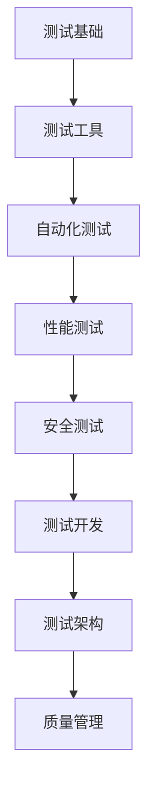

# 测试工程师职业规划

职业规划是测试工程师成长和发展的重要指引。本文将探讨测试工程师的职业发展路径、能力要求和成长策略。

## 🎯 测试工程师职业发展路径

### 1. 初级测试工程师（0-2年）
```markdown
**核心职责：**
- 执行测试用例，发现和报告缺陷
- 编写简单的测试用例
- 参与测试环境搭建和维护
- 学习测试工具和测试方法

**能力要求：**
- 掌握软件测试基础理论
- 熟悉测试流程和规范
- 能够使用常见的测试工具
- 具备良好的沟通和文档能力

**成长重点：**
- 建立完整的测试知识体系
- 积累项目测试经验
- 学习自动化测试基础
- 培养测试思维和问题分析能力
```

### 2. 中级测试工程师（2-5年）
```markdown
**核心职责：**
- 独立负责模块测试
- 设计测试用例和测试方案
- 编写自动化测试脚本
- 参与测试计划和测试策略制定
- 指导初级测试工程师

**能力要求：**
- 精通测试用例设计方法
- 掌握自动化测试框架
- 熟悉性能测试和安全测试
- 具备一定的编程能力
- 能够进行测试分析和报告

**成长重点：**
- 深入掌握自动化测试技术
- 学习性能测试和安全测试
- 提升测试架构设计能力
- 培养项目管理能力
- 建立技术影响力
```

### 3. 高级测试工程师/测试专家（5-8年）
```markdown
**核心职责：**
- 负责复杂系统的测试架构设计
- 制定测试策略和测试标准
- 搭建和维护测试框架
- 解决复杂的技术问题
- 进行技术分享和团队培训

**能力要求：**
- 精通测试架构设计
- 深入理解系统架构和技术栈
- 具备丰富的自动化测试经验
- 能够进行性能调优和安全评估
- 具备技术领导力和影响力

**成长重点：**
- 深入理解业务和技术架构
- 建立测试技术体系
- 培养技术领导力
- 参与技术社区和开源项目
- 建立个人技术品牌
```

### 4. 测试经理/测试总监（8年以上）
```markdown
**核心职责：**
- 负责测试团队管理和建设
- 制定测试部门发展规划
- 管理测试预算和资源
- 建立测试流程和规范
- 推动测试技术创新

**能力要求：**
- 丰富的团队管理经验
- 精通测试流程和质量管理
- 具备战略规划和执行能力
- 优秀的沟通和协调能力
- 熟悉业务和行业趋势

**成长重点：**
- 提升团队管理和领导力
- 学习业务和产品管理
- 建立质量管理体系
- 培养战略思维能力
- 建立行业影响力
```

### 5. 测试开发工程师/质量架构师
```markdown
**核心职责：**
- 设计和开发测试工具和平台
- 构建持续集成和持续交付流水线
- 设计和实施质量保障体系
- 进行技术选型和架构设计
- 推动测试技术创新

**能力要求：**
- 精通软件开发和架构设计
- 深入理解DevOps和CI/CD
- 具备丰富的测试工具开发经验
- 熟悉云计算和容器技术
- 具备技术创新能力

**成长重点：**
- 深入掌握软件开发和架构
- 学习DevOps和云原生技术
- 参与开源项目和技术社区
- 建立技术深度和广度
- 推动测试技术发展
```

## 📊 测试工程师能力模型

### 1. 技术能力
```markdown
**基础技术能力：**
- 软件测试理论和方法
- 测试用例设计技术
- 缺陷管理和分析
- 测试流程和规范

**自动化测试能力：**
- Web自动化测试（Selenium、Playwright等）
- 接口自动化测试（Postman、JMeter等）
- 移动端自动化测试（Appium等）
- 自动化测试框架设计

**性能测试能力：**
- 性能测试理论和方法
- 性能测试工具使用（JMeter、LoadRunner等）
- 性能分析和调优
- 容量规划和评估

**安全测试能力：**
- 安全测试基础
- 常见安全漏洞和防护
- 安全测试工具使用
- 安全评估和审计

**开发能力：**
- 编程语言（Python、Java等）
- 脚本编写和工具开发
- 测试框架开发
- 持续集成和持续交付
```

### 2. 业务能力
```markdown
**业务理解能力：**
- 理解业务需求和业务流程
- 分析业务场景和用户行为
- 识别业务风险和关键点
- 提出业务改进建议

**产品思维：**
- 理解产品定位和目标用户
- 分析产品功能和用户体验
- 参与产品设计和评审
- 提出产品优化建议

**行业知识：**
- 了解行业发展趋势
- 熟悉行业标准和规范
- 分析竞争对手和行业最佳实践
- 建立行业认知和洞察
```

### 3. 软技能
```markdown
**沟通能力：**
- 清晰表达测试发现和建议
- 有效沟通测试进度和风险
- 协调开发和产品团队
- 编写清晰的测试文档

**问题解决能力：**
- 分析复杂问题
- 制定解决方案
- 实施和验证解决方案
- 总结和分享经验

**团队协作能力：**
- 积极参与团队协作
- 分享知识和经验
- 帮助团队成员成长
- 建立良好的团队氛围

**学习能力：**
- 主动学习新技术和方法
- 快速掌握新工具和框架
- 持续改进和优化
- 适应变化和挑战
```

### 4. 管理能力
```markdown
**项目管理能力：**
- 制定测试计划和策略
- 管理测试进度和质量
- 识别和管理风险
- 评估和报告测试结果

**团队管理能力：**
- 团队建设和人才培养
- 任务分配和绩效管理
- 团队激励和文化建设
- 冲突解决和团队协调

**战略规划能力：**
- 制定测试部门发展规划
- 技术选型和架构规划
- 资源规划和预算管理
- 推动测试技术创新
```

## 🚀 测试工程师成长策略

### 1. 学习路线规划


### 2. 学习资源推荐
```markdown
**书籍推荐：**
1. 《软件测试的艺术》- Glenford J. Myers
2. 《Google软件测试之道》- James A. Whittaker
3. 《测试架构师修炼之道》- 刘琛梅
4. 《敏捷软件测试》- Lisa Crispin
5. 《性能之巅》- Brendan Gregg

**在线课程：**
1. 极客时间《软件测试实战》
2. 慕课网测试相关课程
3. Coursera软件测试课程
4. Udemy自动化测试课程

**技术社区：**
1. 测试之家社区
2. GitHub开源测试项目
3. Stack Overflow测试板块
4. 测试技术博客和公众号
```

### 3. 实践项目建议
```markdown
**个人项目：**
1. 搭建个人测试环境
2. 开发测试工具和脚本
3. 参与开源测试项目
4. 编写技术博客和文章

**工作项目：**
1. 主导模块测试工作
2. 实施自动化测试项目
3. 进行性能测试和优化
4. 推动测试流程改进

**社区贡献：**
1. 参与技术社区讨论
2. 分享测试经验和心得
3. 贡献开源测试项目
4. 组织技术分享活动
```

### 4. 职业发展建议
```markdown
**短期目标（1-2年）：**
1. 掌握测试基础理论和工具
2. 积累项目测试经验
3. 学习自动化测试基础
4. 建立个人知识体系

**中期目标（3-5年）：**
1. 深入掌握自动化测试技术
2. 学习性能测试和安全测试
3. 提升测试架构设计能力
4. 建立技术影响力

**长期目标（5年以上）：**
1. 深入理解业务和技术架构
2. 建立测试技术体系
3. 培养技术领导力
4. 建立个人技术品牌
```

## 📈 测试工程师薪资水平

### 1. 薪资水平参考（一线城市）
```markdown
**初级测试工程师（0-2年）：**
- 月薪范围：8,000 - 15,000元
- 年薪范围：10 - 20万元
- 主要城市：北京、上海、深圳、杭州

**中级测试工程师（2-5年）：**
- 月薪范围：15,000 - 25,000元
- 年薪范围：20 - 35万元
- 技能要求：自动化测试、性能测试

**高级测试工程师（5-8年）：**
- 月薪范围：25,000 - 40,000元
- 年薪范围：35 - 60万元
- 技能要求：测试架构、技术领导力

**测试经理/测试总监（8年以上）：**
- 月薪范围：40,000 - 80,000元
- 年薪范围：60 - 120万元
- 技能要求：团队管理、战略规划

**测试开发工程师/质量架构师：**
- 月薪范围：30,000 - 60,000元
- 年薪范围：45 - 90万元
- 技能要求：开发能力、架构设计
```

### 2. 影响薪资的因素
```markdown
**技术能力：**
- 自动化测试技能
- 性能测试和安全测试技能
- 编程和开发能力
- 测试架构设计能力

**业务能力：**
- 业务理解和分析能力
- 产品思维和用户体验
- 行业知识和洞察

**软技能：**
- 沟通和协调能力
- 问题解决能力
- 团队协作能力
- 学习和发展能力

**公司因素：**
- 公司规模和行业
- 技术栈和业务复杂度
- 团队规模和文化
- 地理位置和城市

**个人因素：**
- 工作经验和项目经历
- 学历和证书
- 技术社区贡献
- 个人品牌和影响力
```

## 🔧 测试工程师证书和认证

### 1. 国际认证
```markdown
**ISTQB认证：**
- Foundation Level（基础级）
- Advanced Level（高级）
- Expert Level（专家级）
- 特点：国际通用，体系完整

**CSTE认证：**
- Certified Software Test Engineer
- 特点：注重实践，美国认可度高

**CSQA认证：**
- Certified Software Quality Analyst
- 特点：注重质量分析，适合质量管理人员
```

### 2. 国内认证
```markdown
**全国计算机等级考试：**
- 软件测试工程师
- 特点：国家认证，认可度高

**华为认证：**
- HCIA-Cloud Service
- HCIP-Cloud Service
- HCIE-Cloud Service
- 特点：云计算领域，华为生态

**阿里云认证：**
- ACA（助理工程师）
- ACP（专业工程师）
- ACE（高级工程师）
- 特点：云计算领域，阿里生态
```

### 3. 技术认证
```markdown
**自动化测试认证：**
- Selenium认证
- Appium认证
- JMeter认证

**性能测试认证：**
- LoadRunner认证
- JMeter认证
- NeoLoad认证

**安全测试认证：**
- CEH（Certified Ethical Hacker）
- OSCP（Offensive Security Certified Professional）
- CISSP（Certified Information Systems Security Professional）
```

## 🌟 测试工程师成功要素

### 1. 技术深度和广度
```markdown
**技术深度：**
- 深入掌握测试核心技术
- 精通自动化测试框架
- 理解系统架构和原理
- 能够解决复杂技术问题

**技术广度：**
- 了解相关技术领域
- 学习新技术和趋势
- 掌握多种测试工具
- 具备跨领域知识
```

### 2. 业务理解和洞察
```markdown
**业务理解：**
- 深入理解业务需求
- 分析业务流程和场景
- 识别业务风险和机会
- 提出业务改进建议

**行业洞察：**
- 了解行业发展趋势
- 分析竞争对手和最佳实践
- 建立行业认知和判断
- 把握行业发展机会
```

### 3. 持续学习和成长
```markdown
**学习态度：**
- 保持好奇心和求知欲
- 主动学习新技术和方法
- 持续改进和优化
- 适应变化和挑战

**成长路径：**
- 制定个人成长计划
- 寻找导师和学习伙伴
- 参与技术社区和活动
- 建立个人知识体系
```

### 4. 职业规划和执行
```markdown
**职业规划：**
- 明确职业目标和发展方向
- 制定短期和长期计划
- 评估和调整规划
- 把握职业发展机会

**执行能力：**
- 将计划转化为行动
- 克服困难和挑战
- 评估和总结成果
- 持续改进和优化
```

---

测试工程师的职业发展是一个持续学习和成长的过程。通过明确职业目标、制定成长计划、持续学习和实践，你可以不断提升自己的技术能力和职业竞争力，实现职业发展和个人成长。

记住：职业发展不仅仅是技术能力的提升，还包括业务理解、软技能、管理能力等多方面的成长。保持学习的态度，积极面对挑战，你将在测试领域取得更大的成就。