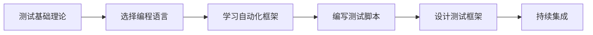

# 自动化测试

自动化测试是使用自动化工具编写和执行测试用例的过程，能够显著提高测试效率和质量。

## 🤖 为什么需要自动化测试？

### 自动化测试的优势

✅ **提高效率** - 机器执行速度远超人工  
✅ **减少成本** - 长期来看能降低测试成本  
✅ **提高覆盖率** - 能够执行更多的测试场景  
✅ **快速反馈** - 及时发现代码变更引入的问题  
✅ **支持持续集成** - 与CI/CD流程无缝集成  
✅ **提高准确性** - 避免人为疏忽和错误

### 自动化测试的局限性

❌ **初期投入大** - 需要时间学习和搭建框架  
❌ **维护成本高** - 需求变更时需要更新脚本  
❌ **不能替代手工测试** - 某些场景仍需人工测试  
❌ **无法发现所有问题** - 特别是UI/UX相关问题

## 📚 学习内容

### Web 自动化测试
- [Selenium WebDriver](Selenium/) - 最流行的Web自动化测试框架
- [Playwright](Playwright/) - 微软出品的现代化测试框架
- [Cypress](Cypress/) - 专为现代Web打造的E2E测试框架

### 移动端自动化测试
- [Appium](Appium/) - 跨平台移动应用自动化测试工具

## 🎯 自动化测试金字塔

```
        /\
       /  \  E2E测试（少量）
      /____\
     /      \
    / 集成测试 \ （适量）
   /__________\
  /            \
 /   单元测试    \ （大量）
/________________\
```

### 测试分层策略

1. **单元测试（70%）**
   - 数量最多、运行最快
   - 测试独立的函数和方法
   - 由开发人员编写

2. **集成测试（20%）**
   - 测试模块间的集成
   - API接口测试
   - 组件交互测试

3. **E2E测试（10%）**
   - 端到端的业务流程测试
   - UI自动化测试
   - 数量少但覆盖关键业务场景

## 🛠️ 自动化测试框架选择

### 选择标准

| 考虑因素 | 说明 |
|---------|------|
| **测试对象** | Web、移动端、API等不同对象选择不同工具 |
| **技术栈** | 团队熟悉的编程语言 |
| **社区支持** | 活跃的社区和丰富的文档 |
| **学习成本** | 学习曲线和上手难度 |
| **维护成本** | 框架的稳定性和长期支持 |

### 常用框架对比

#### Web自动化

| 框架 | 语言支持 | 优势 | 适用场景 |
|------|---------|------|---------|
| Selenium | Python/Java/C#/JS | 成熟稳定、社区大 | 传统Web应用 |
| Playwright | JS/TS/Python/C# | 速度快、功能强 | 现代Web应用 |
| Cypress | JavaScript | 开发友好、调试方便 | 前端开发测试 |

#### 移动端自动化

| 框架 | 平台支持 | 优势 | 适用场景 |
|------|---------|------|---------|
| Appium | iOS/Android | 跨平台、语言多 | 原生/混合应用 |
| Espresso | Android | 速度快、稳定 | Android原生 |
| XCUITest | iOS | 官方支持 | iOS原生 |

## 💡 自动化测试最佳实践

### 1. 选择合适的测试用例自动化
```
✅ 适合自动化：
- 频繁执行的冒烟测试
- 回归测试用例
- 数据驱动的测试
- 性能和负载测试

❌ 不适合自动化：
- 一次性的测试用例
- 需求频繁变更的功能
- 复杂的UI/UX测试
- 探索性测试
```

### 2. 使用Page Object模式
```python
# Good - 使用POM模式
class LoginPage:
    def __init__(self, driver):
        self.driver = driver
        self.username_input = (By.ID, "username")
        self.password_input = (By.ID, "password")
        self.login_button = (By.ID, "loginBtn")
    
    def login(self, username, password):
        self.driver.find_element(*self.username_input).send_keys(username)
        self.driver.find_element(*self.password_input).send_keys(password)
        self.driver.find_element(*self.login_button).click()
```

### 3. 编写可维护的测试代码
- 遵循编码规范
- 添加适当的注释
- 使用有意义的变量名
- 避免硬编码
- 模块化和复用

### 4. 合理使用等待机制
```python
# Bad - 固定等待
time.sleep(5)

# Good - 显式等待
wait = WebDriverWait(driver, 10)
element = wait.until(EC.presence_of_element_located((By.ID, "myElement")))
```

### 5. 独立的测试用例
- 每个测试用例应该独立运行
- 不依赖其他测试用例的结果
- 准备自己的测试数据
- 清理测试产生的数据

### 6. 持续集成
- 将自动化测试集成到CI/CD流程
- 定时执行回归测试
- 及时通知测试结果
- 生成测试报告

## 📊 测试报告

优秀的测试报告工具：

- **Allure** - 美观的测试报告框架
- **ExtentReports** - 详细的HTML报告
- **pytest-html** - pytest的HTML报告插件
- **TestNG Reports** - TestNG内置报告

## 🚀 学习路线



### 推荐学习步骤

1. **掌握编程基础** - Python/Java等
2. **学习Web基础** - HTML、CSS、JavaScript
3. **熟悉测试框架** - Selenium、Pytest等
4. **实战练习** - 编写真实项目的测试脚本
5. **框架设计** - 搭建可维护的测试框架
6. **持续优化** - 优化脚本、提高稳定性

---

> 💡 **边界测试官的话**：
> 
> 自动化测试是测试工程师的核心竞争力之一，但要记住：自动化是手段，不是目的。合理地选择自动化场景，编写稳定可维护的测试代码，才能真正发挥自动化测试的价值。
> 
> 不要为了自动化而自动化，要为了提高效率和质量而自动化！💪
